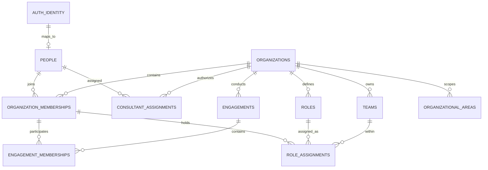
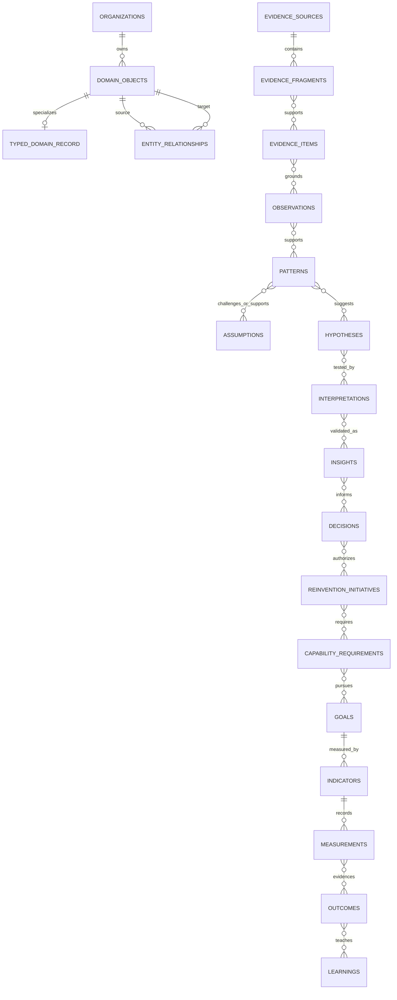
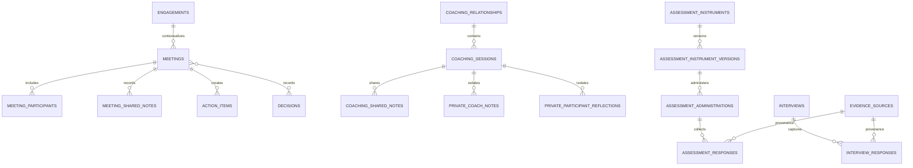

# Phase 0 ERD proposal

**Status:** Accepted for Phase 0 on 2026-08-10.

This design translates the restored Canonical Document 03 without reusing Ministry tables. It is not a migration. Phase 1 is now authorized within this accepted design; production migration remains separately unauthorized.

## Tenancy and identity

Every organization-owned table carries `organization_id`. Child and relationship tables use composite foreign keys to prevent cross-organization links. Engagement narrows context but is never a tenant.

## Typed object registry and reasoning chain

`TYPED_DOMAIN_RECORD` represents separate constrained tables listed in `DOMAIN-SCHEMA-MAPPING.md`; it is not one generic content table. `DOMAIN_OBJECTS` exists only for shared identity, same-tenant endpoint integrity, and graph traversal.

## Identity, design, capability, and New Reality

```mermaid
flowchart LR
    Identity["Identity Elements"] --> DNA["Organizational DNA version"]
    Evidence["Validated Insight / Diagnosis"] --> Narrative["Future-State Narrative"]
    DNA --> Blueprint["Organizational Blueprint"]
    Narrative --> Principles["Future-State Principles"]
    Principles --> Blueprint
    Blueprint --> Decision["Decision"]
    Decision --> Design["Responsibilities / Authority / Boundaries / Interfaces / Workflows"]
    Design --> Capability["Capability Requirements / Gaps / Development Plans"]
    Capability --> Outcomes["Goals / Indicators / Outcomes / Learning"]
    Outcomes --> Profile["Emergent Organization Profile"]
    Profile --> Baseline["Baseline Snapshot"]
    Baseline --> SeeAgain["Current Signal Set / SEE AGAIN"]
```

Future State, Emergent Organization Profile, and Baseline Snapshot are distinct records. A snapshot records a manifest of operative object versions rather than overwriting history.

## Meetings, coaching, assessment, and privacy

Private coach notes, participant reflections, confidential assessment responses, and confidential interview responses are physically partitioned and are never ordinary organization telemetry.

## Shared record columns

All applicable typed records follow the Document 03 contract: stable UUID, direct `organization_id`, optional `engagement_id`, title/name, content, controlled status, roadmap stage, creator/time, effective dates, supersession, visibility, origin, and provenance. Versioned records add `logical_id` and `version_number`. Inferential records add review state, reviewer, rationale, limitations, and contrary evidence links.

## Relationship enforcement

`entity_relationships.organization_id = source.organization_id = target.organization_id` is enforced by composite foreign keys. Relationship type and direction are validated against the exact Section 14 source-to-target matrix. Endpoint authorization is evaluated independently, so an edge cannot bypass visibility. Required structural parentage remains a direct foreign key; the graph layer does not replace core integrity. AI inferential edges begin suggested, and an accepted `CAUSES` edge requires the exceptional human-reviewed evidence and rationale contract in Section 19.

## Implementation order

1. Phase 1: tenancy, identity mapping, assignments, memberships, visibility, audit, storage.
2. Phase 2: registry, evidence/source fragments, reasoning-chain tables, relationships, decisions, versioning.
3. Phase 3 onward: consulting, portal, meeting/coaching, design/capability, outcome/New Reality, AI, and descriptive Signals tables in Document 07 order.

No table in this ERD is authorized for implementation or production migration until the final Phase 0 checkpoint explicitly authorizes Phase 1 and any target environment is separately approved.
